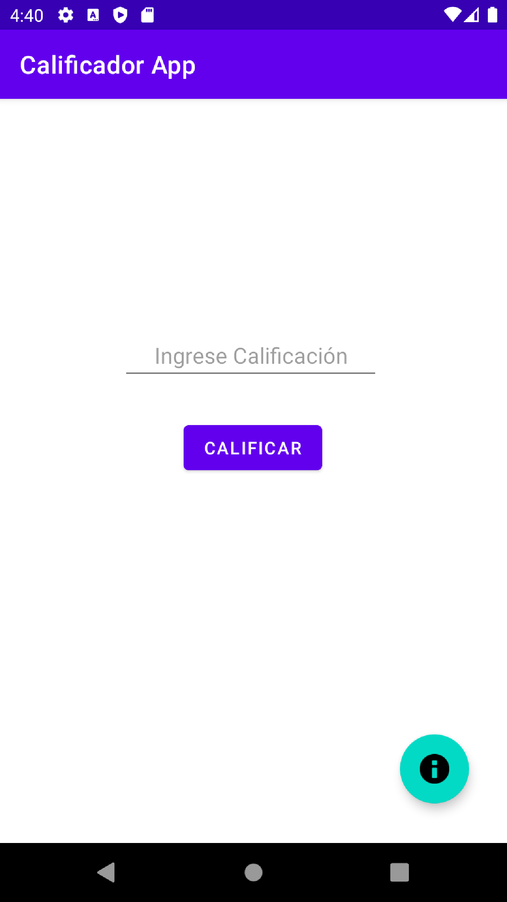
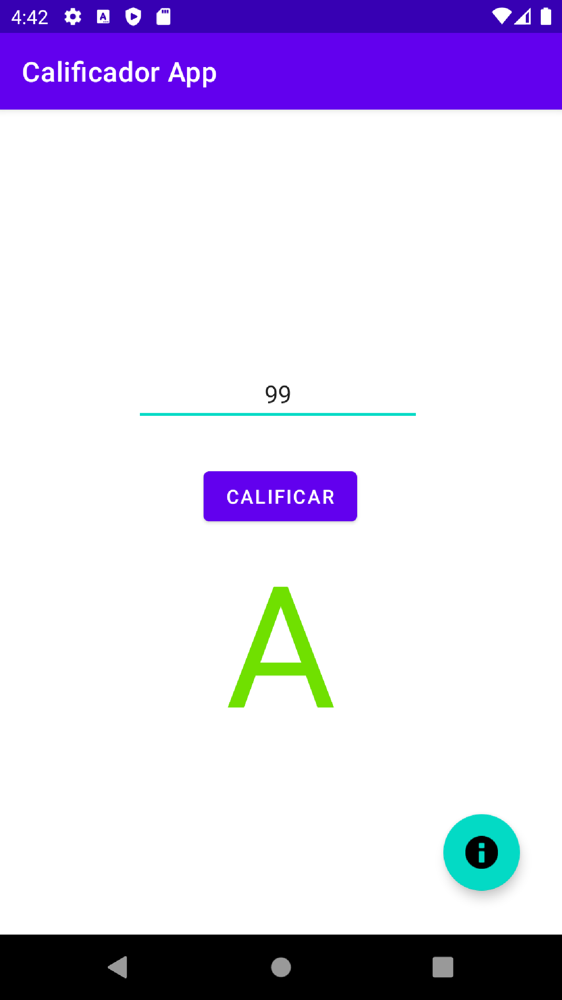
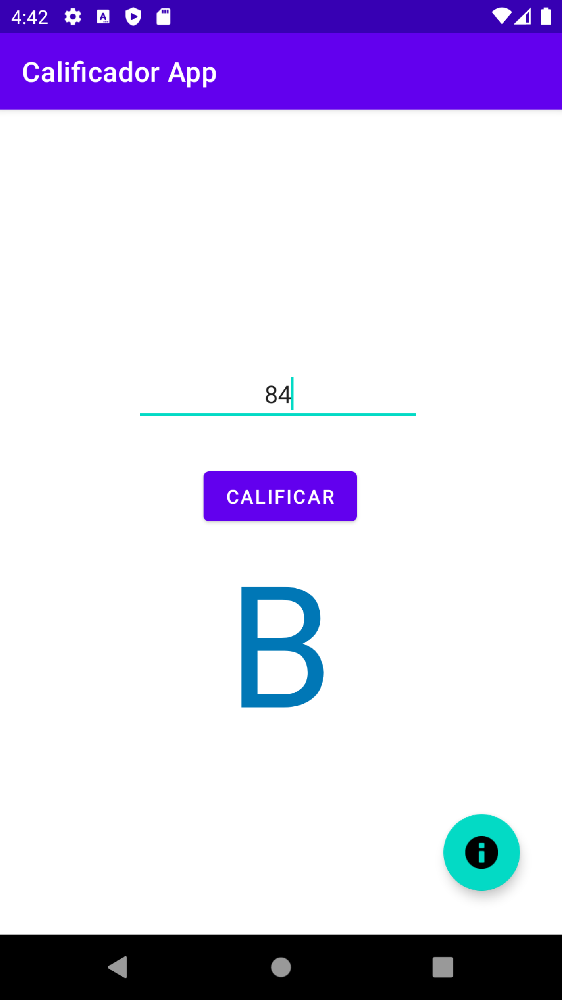
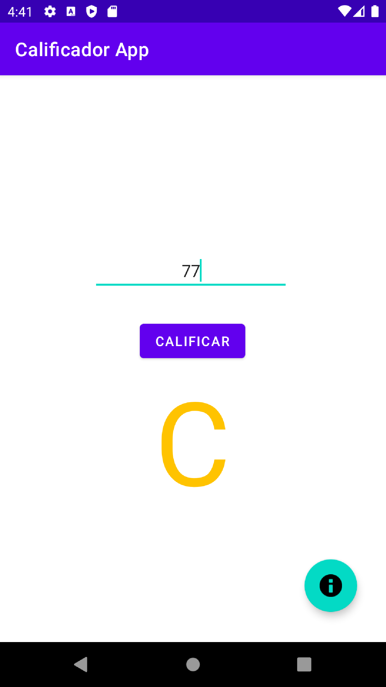
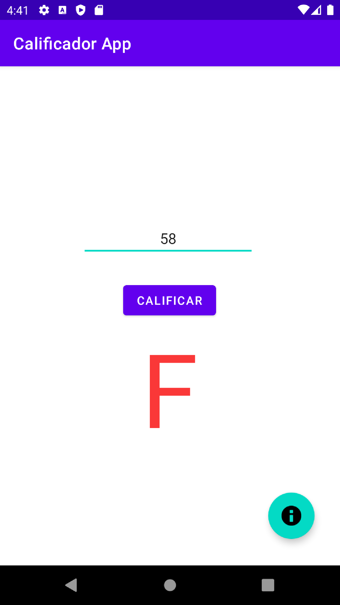
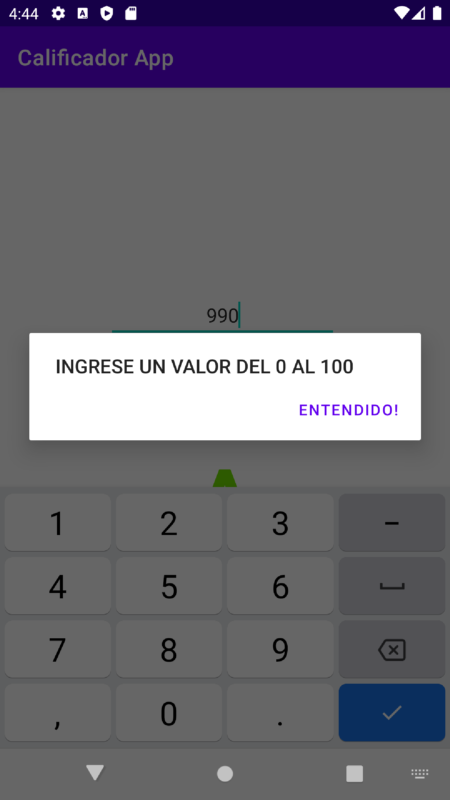

# Calificador-App

Esta es una App móvil nativa android desarrollada con kotlin. La cual se basa dependiendo la calificación le mostrará el valor pero literal (A, B, C o F).

## Interfaz Gráfica del Proyecto:

